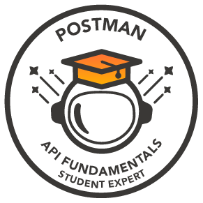

<h1 align="center">
    
</h1>

<h3 align="center">A passionate software developer from India 🇮🇳</h3>

 

 
 🔭 I’m currently working on **Skin Cancer Prediction using AI/ML and Data Science** for my final year project.
 
 🌱 I’m currently learning **MERN stack development**.

💬 Ask me about **full-stack web development, Node.js, React, or anything [here](https://github.com/Shrutika006/Shrutika006/issues)**.

😊 Hobbies : **I really enjoy sketching and content writing!**

 

 

 
  
  
  

 
<h2 align="center">⚒️ Languages, Frameworks & Tools ⚒️</h2>
 

    
     

 

	
 
GSSOC'24 Dynamic Badges 🪶

<a href="https://api.badgr.io/public/assertions/70OJPmyXRgeWIpSamWYx4Q?identity__email=shrutika.vetal06%40gmail.com">

<!--GSSoC 1st Explorer Badge on 60 points-->

<!--GSSoC 2nd Adventurer Badge on 140 points-->

<!--GSSoC 3rd Trailblazer Badge on 200 points-->

<!--GSSoC 4th Summit Seeker Badge	on 300 points-->

<!--GSSoC 5th Champion Badge on 500 points-->

  <h2>🐍 My Contributions 🐍</h2>
<!--    -->

  

 
  
